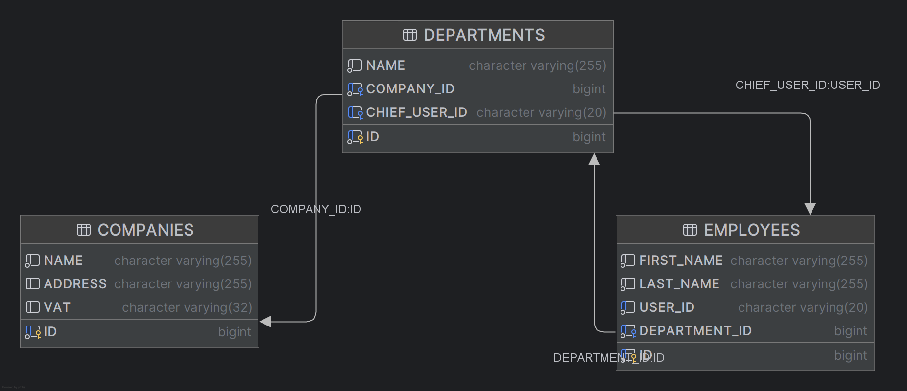

# Performance Optimization in Spring Boot with Hibernate

## Overview

This project serves as a practical training ground for identifying and resolving common performance issues in Spring Boot applications that use Hibernate ORM. The application deliberately contains several performance anti-patterns that participants will learn to recognize, analyze, and optimize during the training sessions.

## Objectives

The training focuses on the following performance challenges:

1. **N+1 Query Problem** - Recognize and resolve inefficient database access patterns where an initial query is followed by N additional queries.

2. **Row Explosion & Excessive Data Transfer** - Identify situations where queries return unnecessarily large result sets or excessive data.

3. **Open Session In View Anti-pattern** - Understand the implications of this Spring Boot default setting and its impact on performance.

4. **Connection Pool Exhaustion** - Learn to detect and mitigate issues related to database connection management.

5. **External API Calls** - Optimize interactions with external services to minimize performance bottlenecks.

## Getting Started

### Prerequisites

- JDK 11 or newer
- Maven 3.6+
- IntelliJ IDEA (recommended)

### Setup

1. Install dependencies:
```
   mvn install
```

2. Run the application: 
Run "Run Spring Boot" configuration in the run configurations dropdown

3. The application will start on `http://localhost:8080`

### Testing the API

Use the HTTP request files in the `api/request` folder to interact with the application endpoints. These files can be executed directly from IntelliJ IDEA if you're using the HTTP Client plugin.

## Database Structure

The application uses an in-memory database with a schema designed to demonstrate various performance scenarios through entities like:




## Exercises

The exercices should be done sequentially.

### N+1 Problem
1. in api/request , run "Search companies - N+1 test case"
2. Use the tools to find out the problem (spoiler alert; it's the name of the request)
3. Fix it

### Open Session in View
1. Disable Open session in view `spring.jpa.open-in-view: false` in `application.yaml`
2. in api/request , run "Search companies with full list of employees - Open In View test case"
3. You should get a 500.
4. Fix it. 

### BatchSize
Instead of fetching all employees of all department of all companies, wich would result in a cartesian of c*d*e.
Optimize it with batchsize.
Request is "Search companies with full list of employees - Open In View test case"

